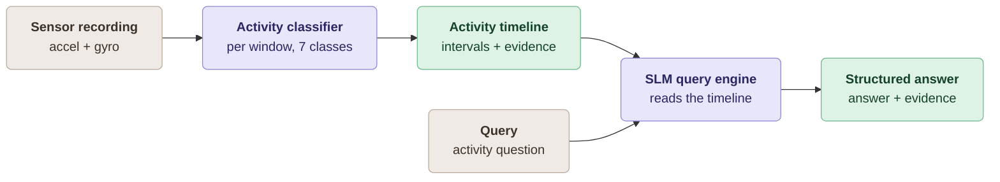

# ExtraSensorySLM

**Grounded, Explainable Activity Question Answering from Wearable Signals**
CS60055 Ubiquitous Computing · Hackathon Challenge · IIT Kharagpur

---

## About the project

This project is a **sensor question-answering system**. It takes two inputs
timestamped accelerometer and gyroscope recording, and a question in plain English
and returns an accurate answer together with the specific stretch of signal that
justifies it.

An ordinary activity classifier only emits a label such as *walking* for each instant.
It cannot say for how long, how often, at what time, or on what basis. This system adds
that layer: it turns per-window predictions into a structured activity timeline and
answers questions against it, always citing the evidence behind each claim.

**What the system does**

A recording arrives at whatever rate the device produced, often uneven. It is
resampled onto a common 40 Hz/25 Hz time base using its real timestamps, cut into 3-second
windows, and classified into seven activity and posture classes: lying down, sitting,
standing in place, standing and moving, walking, running and bicycling. Neighbouring
predictions are smoothed and merged into an **activity timeline** — a list of
intervals, each carrying a start time, an end time, a confidence value, and the
measured signal features that characterise it. Every question is then answered from
this timeline.

The system handles four kinds of question:

- **Identification** — which activity is being performed, or whether a named activity occurred
- **Temporal and quantitative reasoning** — how long an activity lasted, how many times it happened, when it began, which of two activities took more time
- **Evidence grounding** — every answer cites the interval, sensor modality and channels that support it, with reasoning tied to the observed signal
- **Open-world reasoning** — broader behaviours the classifier was never trained to name, such as prolonged rest, strenuous effort, or wheeled movement, inferred from the detected activities and their motion characteristics

**Design principle**

Duties are strictly separated. All numbers — durations, counts, onsets, intervals — are
computed by deterministic code from the timeline. The small language model is used only
to interpret how a question is phrased and to write the explanation in readable
English. It never sees a sensor sample, never performs arithmetic, and never chooses a
timestamp. Because it is only handed facts that have already been established, it
cannot invent one. If the language model fails or is disabled, the system still returns
the same answer with the same evidence, using a template explanation.

---

## Pipeline
 

 
---

## Folder structure

```
ExtraSensorySLM/
│
├── data/                    ExtraSensory dataset (not committed — fetched by script)
│   ├── raw_acc/             raw accelerometer recordings
│   ├── raw_gyro/            raw gyroscope recordings
│   ├── labels/              cleaned per-user labels
│   ├── original/            original labels (splits the two standing classes)
│   └── cv_folds/            official train/test partition
│
├── download_data.sh         fetch and unpack the dataset
├── label_table.py           build the ground-truth table
├── extract_windows.py       resample + window the raw signals
├── train.py                 train and evaluate the activity classifier
├── timeliner.py             recording → activity timeline
├── answer_qwen.py           question answering with Qwen3-4B
├── answer_phi.py            question answering with Phi-3.5-mini
│
├── label_table.csv          generated · user, timestamp, activity
├── windows.npz              generated · labelled training windows
├── model.joblib             generated · trained classifier
└── timeline.json            generated · activity intervals + evidence
```

---

## What each file does

| File | Purpose |
|---|---|
| `download_data.sh` | Downloads the five ExtraSensory archives and unpacks them into `data/`. The two raw-signal archives are large, so they are fetched one at a time. |
| `label_table.py` | Reads the label files and keeps every minute where exactly one of the seven activities applies, splitting *standing in place* from *standing and moving* using the original labels. Writes `label_table.csv`. |
| `extract_windows.py` | For each labelled minute, pairs the accelerometer and gyroscope files, resamples them onto an even 40 Hz / 25 Hz grid using their real timestamps, and cuts overlapping 3-second windows. Writes `windows.npz`. |
| `train.py` | Computes gravity-separated features, balances the classes by capping the majority and augmenting the minority, trains the classifier, and evaluates it with 5-fold leave-users-out cross-validation. Writes `model.joblib`. |
| `timeliner.py` | Takes a raw recording (a single file or a participant's whole day), classifies non-overlapping windows, smooths prediction flicker, merges runs into intervals, and records the measured signal features of each. Writes `timeline.json`. |
| `answer_qwen.py` | The query engine. Parses the question into a structured intent, computes the answer from `timeline.json` in code, selects the supporting intervals, and renders the challenge's output format. Uses Qwen3-4B for language understanding and explanation. |
| `answer_phi.py` | Identical to the above, with Phi-3.5-mini in place of Qwen. Only the model wrapper differs, so the two can be compared on equal terms. |

---

## Setup

```bash
pip install numpy scipy pandas scikit-learn joblib torch transformers
bash download_data.sh
```

The dataset is roughly 80 GB and is not committed to the repository.

---

## How to run

**Prepare the data and train the classifier** — run once:

```bash
python3 label_table.py        # → label_table.csv
python3 extract_windows.py    # → windows.npz
python3 train.py              # → model.joblib
```

**Build a timeline** for a recording:

```bash
python3 timeliner.py --user <UUID>  --model                     # a participant's full recording
python3 timeliner.py --user <UUID>  --model --max-minutes 200   # a participant's full recording (for How much duration)
python3 timeliner.py --acc <acc.dat> --gyro <gyro.dat> --model  # a single recording
```
→ writes `timeline.json`

**Ask questions:**

```bash
# one question
python3 answer_qwen.py --timeline timeline.json \
        --question "How long was the user walking?"

# a file of questions, one per line
python3 answer_qwen.py --timeline timeline.json \
        --questions questions.txt --out answers.txt

# the other model
python3 answer_phi.py  --timeline timeline.json \
        --question "Did the user lie down for a prolonged period?"

```

---

## Output format

Every response uses the required fields, in order. Timestamps are **seconds from the
start of the recording**.

```
Answer: <direct answer to the query, or N/A>
Activity/Event: <activity or event, or N/A>
Evidence:
  Timestamp(s): <time range or ranges, or N/A>
  Sensor Modality: <accelerometer, gyroscope, or both, or N/A>
  Sensor Channel(s): <Acc X/Y/Z, Gyro X/Y/Z, All, or N/A>
Explanation: <reasoning grounded in the observed signal, or N/A>
```

**Example**

```
Query: "Did the user begin running at any point, and if so, when?"
Answer: Yes, running began at 1512.0 seconds
Activity/Event: Onset of running
Evidence:
  Timestamp(s): 1512.0 to 1980.0 (seconds from start)
  Sensor Modality: Accelerometer, Gyroscope
  Sensor Channel(s): All
Explanation: The transition into running occurs at 1512.0 seconds and the bout
  continues to 1980.0 seconds. The cited signal shows a sustained rise in
  acceleration magnitude at a higher step frequency together with larger
  gyroscope oscillations.
```

---

## Contribution

| Member | Roll number | Contribution |
|---|---|---|
| Nishant Kumar Das | 25CS72P06 |  |
|  |  |  |
|  |  |  |